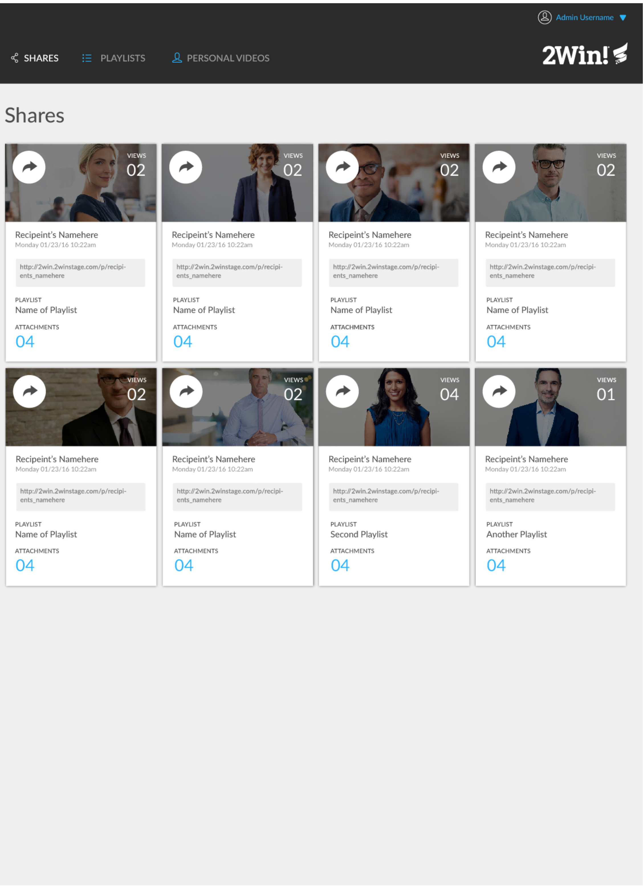

# Comp 1 Challenge

This is the first project I completed during the front end program at the [Turing School of Software and Design](https://https://turing.io/). The point of the project was to build a 1-page static site to practice writing well structured, semantic HTML with clean, precise CSS, as well as adding some user interaction with Javascript and the DOM.

You can visit the live finished version of this project at https://ryandbarnett.github.io/dog-party/.

## Key Features

* **Responsive** - The content looks good on any screen size
* **Mobile Menu** - I implemented a mobile menu using Javascript that shows or hides when the user clicks the menu icon.
* **Flexbox** - Uses flexbox to make layout fluid

## Built With

* [HTML](https://developer.mozilla.org/en-US/docs/Web/Guide/HTML/HTML5)
* [CSS](https://developer.mozilla.org/en-US/docs/Web/CSS)

## Authors

* **Ryan Barnett** - [Ryan's Github](http://github.com/RyanDBarnett)

## What The Site Should Look Like

## Finished Project

## License

This project is licensed under the MIT License - see the [LICENSE.md](LICENSE.md) file for details
